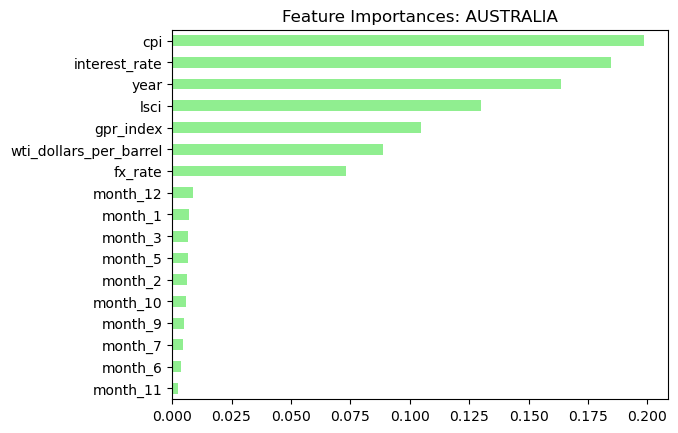
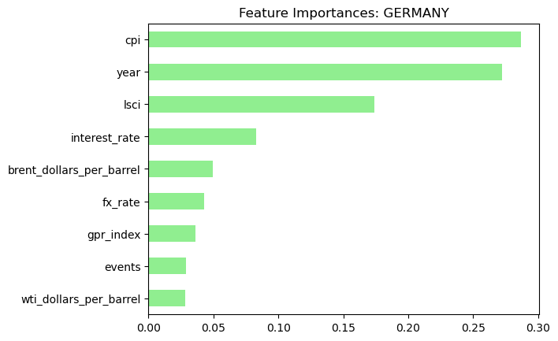

# MLProject — Random Forest Imputation
### Executive Summary

This project investigates whether macroeconomic and geopolitical indicators (including oil prices, the Liner Shipping Connectivity Index (LSCI), the Geopolitical Risk Index (GPR), conflict events, CPI, interest rates, and FX rates) can forecast near-term changes in a country’s foreign exchange reserves to support treasury and strategic planning decisions. Data was sourced from seven APIs and public datasets (ACLED, EIA, FRED, IMF, UNCTAD, World Bank, and the Caldara-Iacoviello GPR index), spanning daily, monthly, and quarterly frequencies. A robust data preparation pipeline was built using both pandas and PySpark to handle joins, forward-filling, outlier detection, and frequency alignment across all indicators and countries.

To address a significant reporting lag in World Bank FX reserves data (missing from June 2024 onward), country-level Random Forest Regression models were trained and tuned via GridSearchCV to impute missing values — a deliberate choice over simple forward-fill, which would produce unrealistic flatlines over long gaps. Features were selected per country using F-regression p-values (threshold < 0.05), and each model was cross-validated to minimize negative MSE. Models achieved strong performance (RMSE and R² evaluated on test sets), though R² scores near 0.9999 on most countries suggest overfitting, making these models best suited for near-term predictions in the 3–6 month range.

Key limitations include heterogeneous feature relevance across countries, potential bias from temporal aggregation choices, and an encoding issue with the month feature that caused some rows to be skipped during imputation. Recommended next steps include retraining models without the month variable, implementing a drift-monitoring process for production use, and periodically revalidating imputed values against newly released observed data. The project demonstrates end-to-end data engineering and machine learning skills, from multi-source API ingestion and distributed PySpark pipelines to feature engineering, hyperparameter tuning, and dataset publishing to Kaggle for public reuse.

### Tech Stack:
- Python (pandas, NumPy, scikit-learn)
- PySpark (for demonstrating distributed data processing)
- Jupyter Notebooks
- Git + GitHub
- Kaggle (for dataset distribution)

## Repository Structure
```
README.md
image-1.png
image*2.png
ml_missing_value_impute/
├─ hardcoded_keys.py         # not stored in repo (private API data)
├─ proj_vars.py
├─ import_datasets/          # local raw files (not stored in repo)
│  ├─ australiancpi.csv
│  └─ US_LSCI_M.csv
├─ notebooks/
│  ├─ import_data/           # run these first (API import notebooks)
│  │  ├─ import_acled.ipynb
│  │  ├─ import_eia.ipynb
│  │  ├─ import_fred.ipynb
│  │  ├─ import_gpr_index.ipynb
│  │  ├─ import_imf.ipynb
│  │  ├─ import_unctad.ipynb
│  │  └─ import_wb.ipynb
│  └─ transform/             # run after import_data; impute_missing_data.ipynb is last
│     ├─ impute_missing_data.ipynb
│     └─ joined_input.ipynb
└─ processed_datasets/       # produced outputs (to be uploaded to Kaggle)
   ├─ acled.csv
   ├─ cpi.csv
   ├─ final_df.csv           # Final dataset
   ├─ fred.csv
   ├─ gpr.csv
   ├─ joined_input.csv
   ├─ lsci.csv
   ├─ oil.csv
   └─ wb.csv
```

# The Project

### Business Question: 
#####  Can these indicators (oil prices, LSCI, GPR, events, CPI, rates, FX) forecast near-term changes in a country's FX reserves for treasury/planning decisions?

### Problem and Context: 
For businesses using industry analysis and financial forecasting to inform strategy, lagging or incomplete indicator data can degrade decision quality. In today’s highly competitive economic landscape, businesses need to make quick, data-driven decisions to remain relevant. 

Using imputation and predictive models helps fill gaps and enables more data-focused, timely strategy and positioning decisions. The complexity of operating in a global economic environment can make it challenging to determine how to position a strategy across major economies.

## Summary of the Machine Learning process:
### Sourced Data
Data is gathered from multiple APIs and sources (some monthly, some daily) using the notebooks in `import_data`. 
#### Sources:
* **ACLED:** This includes all global battles, explosions/remote violence, and violence against civilians events.
    * acleddata.com
* **US Energy Information Administration (EIA) daily oil price:** Imported daily spot pricing for Brent Crude Oil and WTI Crude Oil. 
    * eia.gov
* **Federal Reserve Bank of St. Louis (FRED):** Fetched the daily foreign spot exchange rate and daily interest rates for each country.
    * fred.stlouisfed.org
* **Geopolitical Risk Index (GPR):** The Caldara and Iacoviello GPR index is calculated monthly by measuring the share of articles related to adverse geopolitical events across 10 major newspapers.
    * www.matteoiacoviello.com/gpr_files/data_gpr_export.xls
* **International Monetary Fund:** Imported monthly Consumer Price Index (CPI) for each country.
    * imf.org
* **UN Trade and Development (UNCTAD):** Imported the Liner Shipping Connectivity Index, which measures each country’s integration into global liner shipping networks.
    * unctadstat.unctad.org
* **World Bank:** Fetched each country's monthly Foreign Exchange Reserves.
    * worldbank.org 

### Data Preparation
Data cleaning and transformations are done in the `transform` notebooks (primary work in `joined_input.ipynb`; some one-hot encoding in `impute_missing_data.ipynb`).

Most missing-value handling is applied during dataset joins:

- **FRED + Oil**
    - Left-joined on `date`; duplicates checked.
    - Missing `brent_dollars_per_barrel` and `wti_dollars_per_barrel` (market/non-trading days) are forward-filled per country with a window: `W.partitionBy('country').orderBy('date')` + `F.last(..., ignorenulls=True)`.
    - Outlier detection: `detect_outliers_by_partition` on `interest_rate`, `fx_rate`, `brent_dollars_per_barrel`, `wti_dollars_per_barrel` (partitioned by `country`, `year`).

- **ACLED (`events`)**
    - Joined on `['year','month','country']`.
    - Missing `events` interpreted as `0` (assumed no recorded events).
    - Because `acled_df` is monthly vs a daily base, `events` are kept only on the last day of each month per country (row_number over partition → keep last), other days set to `0`.
    - Outlier detection applied to `events` to highlight notable political shocks.

- **CPI**
    - Renamed source `value` → `cpi` and joined on `['year','month','country']`.
    - For missing Australian CPI, imported `import_datasets/australiancpi.csv` (quarterly) and expanded/coalesced values into monthly `cpi`.
    - Applied a small early-2006 correction for Australia and forward-filled `cpi` per country (ordered by `year, month`).

- **GPR**
    - Joined on `['year','month','country']`; no additional missingness required after join.

- **LSCI**
    - Joined on `['year','month','country']`.
    - Reporting frequency changed (quarterly → monthly); forward-fill used per country (`F.last(..., ignorenulls=True)` over `W.partitionBy('country').orderBy('year','month')`).
    - Applied targeted 2006 fixes and seeded missing March/April 2006 values for Australia using a lookup (`lsci_dict`).
    - Removed inconsistent early data (filtered out dates on or before `2006-04-30`).

Notes:
- Forward-fill is used where values are expected to hold until the next report (e.g., index benchmarks, quarterly-to-monthly conversions).

### ML Imputation

`fx_reserves` had a larger temporal gap, and was handled with ML imputation using Random Forest Regression models tailored per country in `impute_missing_data.ipynb` rather than simple propagation. 

The large temporal gap is due to missing data for `2024-06` and beyond, as the World Bank has yet to release data for those months, creating a reporting lag. Because of the lag in data, ML imputation is effective, as the large window of missing data can create unrealistic flatlines from forward-fill imputation. The Random Forest Regressor can incorporate other features in the dataset to produce a more accurate estimate of what to expect for that window of missing data. 

Before training the Random Forest Regression models, the best features were selected for each country using the p-values computed with the `sklearn.feature_selection.f_regression()` function utilizing the `GridSearchCV()` method. The features with p-values less than `0.05` were selected for each country.

```python
# Find best features
for country in country_list:
    print(f"Creating '{country}_selected_features'")
    # Define Variables
    response_var = 'fx_reserves'
    explanatory_var = [var for var in globals()[f'{country}_df'].columns if var not in ['fx_reserves']]

    # Assign values
    X = globals()[f'{country}_df'][explanatory_var]
    y = globals()[f'{country}_df'][response_var]

    # Use SelectKBest
    skbest = SelectKBest(k='all', score_func=f_regression)
    X_skbest = skbest.fit_transform(X, y)
    
    # Finding p-values and dataframe creation.
    pval_df = pd.DataFrame({
        'feature': X.columns,
        'p_value': skbest.pvalues_
    }).sort_values('p_value')

    pval_df = pval_df[pval_df['p_value'] < 0.05]
    globals()[f"{country}_selected_features"] = pval_df['feature'].tolist()
```

Each country had its own Random Forest model trained and cross-validated across multiple hyperparameters to select the best model for predictions. The cross-validated model with the lowest negative MSE was used to identify the best predictive model.

```
Creating RF model: brazil_rf_mdl
Best Negative MSE Score (brazil): -365729.35
Best Hyperparameters: 
 {'max_depth': np.int64(15), 'max_features': 'log2', 'n_estimators': np.int64(75)} 

Creating RF model: canada_rf_mdl
Best Negative MSE Score (canada): -61812.12
Best Hyperparameters: 
 {'max_depth': np.int64(25), 'max_features': 'log2', 'n_estimators': np.int64(75)} 

Creating RF model: japan_rf_mdl
Best Negative MSE Score (japan): -2660905.96
Best Hyperparameters: 
 {'max_depth': np.int64(20), 'max_features': 'log2', 'n_estimators': np.int64(50)} 

Creating RF model: china_rf_mdl
Best Negative MSE Score (china): -44589294.84
Best Hyperparameters: 
 {'max_depth': np.int64(30), 'max_features': 'log2', 'n_estimators': np.int64(75)} 

Creating RF model: australia_rf_mdl
Best Negative MSE Score (australia): -86509.79
Best Hyperparameters: 
 {'max_depth': np.int64(25), 'max_features': 'log2', 'n_estimators': np.int64(75)} 

Creating RF model: germany_rf_mdl
Best Negative MSE Score (germany): -13630167.88
Best Hyperparameters: 
 {'max_depth': np.int64(10), 'max_features': 'log2', 'n_estimators': np.int64(50)} 

Creating RF model: india_rf_mdl
Best Negative MSE Score (india): -1214984.18
Best Hyperparameters: 
 {'max_depth': np.int64(25), 'max_features': 'log2', 'n_estimators': np.int64(75)} 

Creating RF model: mexico_rf_mdl
Best Negative MSE Score (mexico): -110673.23
Best Hyperparameters: 
 {'max_depth': np.int64(20), 'max_features': 'log2', 'n_estimators': np.int64(75)} 

Creating RF model: france_rf_mdl
Best Negative MSE Score (france): -68788.21
Best Hyperparameters: 
 {'max_depth': np.int64(25), 'max_features': 'log2', 'n_estimators': np.int64(75)} 

Creating RF model: italy_rf_mdl
Best Negative MSE Score (italy): -4827378.58
Best Hyperparameters: 
 {'max_depth': np.int64(10), 'max_features': 'log2', 'n_estimators': np.int64(75)} 

Creating RF model: south_africa_rf_mdl
Best Negative MSE Score (south_africa): -10258.79
Best Hyperparameters: 
 {'max_depth': np.int64(25), 'max_features': 'log2', 'n_estimators': np.int64(75)} 

Creating RF model: russia_rf_mdl
Best Negative MSE Score (russia): -910065268.27
Best Hyperparameters: 
 {'max_depth': np.int64(20), 'max_features': 'log2', 'n_estimators': np.int64(50)} 

Creating RF model: south_korea_rf_mdl
Best Negative MSE Score (south_korea): -536708.59
Best Hyperparameters: 
 {'max_depth': np.int64(15), 'max_features': 'log2', 'n_estimators': np.int64(75)} 

Creating RF model: turkiye_rf_mdl
Best Negative MSE Score (turkiye): -27364793.38
Best Hyperparameters: 
 {'max_depth': np.int64(20), 'max_features': 'log2', 'n_estimators': np.int64(50)} 

Creating RF model: united_kingdom_rf_mdl
Best Negative MSE Score (united_kingdom): -149347.09
Best Hyperparameters: 
 {'max_depth': np.int64(15), 'max_features': 'log2', 'n_estimators': np.int64(75)} 

Creating RF model: united_states_rf_mdl
Best Negative MSE Score (united_states): -212875.90
Best Hyperparameters: 
 {'max_depth': np.int64(25), 'max_features': 'log2', 'n_estimators': np.int64(50)}
```

**Summary of the Analysis results:** 
Country-level Random Forest models successfully reduced missingness and produced plausible imputations; tuning via GridSearchCV improved predictive performance compared to default hyperparameters. Each country's models were evaluated using the Root Mean Square Error (RMSE) between the test and training datasets, and overfittedness was tested using the R-Squared Score. 

Overall, the accuracy metrics indicate that each model may be overfit, with R-squared scores of 0.9998 and 0.9999 on most countries' test data. Ideally, the model's predictive capabilities are best suited for near-term predictions, no more than 3-6 months.

```
Train set RMSE of BRAZIL RF: 238.22
Test set RMSE of BRAZIL RF: 680.81
Difference in RMSE between Train and Test data: -442.59 
******
Train set R-squared Score (brazil): 1.0000
Test set R-squared Score (brazil): 0.9999
Difference in R-squared Score between Train and Test data: 0.0001

Train set RMSE of CANADA RF: 86.73
Test set RMSE of CANADA RF: 173.08
Difference in RMSE between Train and Test data: -86.35 
******
Train set R-squared Score (canada): 1.0000
Test set R-squared Score (canada): 0.9999
Difference in R-squared Score between Train and Test data: 0.0000

Train set RMSE of JAPAN RF: 600.11
Test set RMSE of JAPAN RF: 1344.62
Difference in RMSE between Train and Test data: -744.51 
******
Train set R-squared Score (japan): 1.0000
Test set R-squared Score (japan): 0.9999
Difference in R-squared Score between Train and Test data: 0.0001

Train set RMSE of CHINA RF: 2478.25
Test set RMSE of CHINA RF: 5647.35
Difference in RMSE between Train and Test data: -3169.10 
******
Train set R-squared Score (china): 1.0000
Test set R-squared Score (china): 0.9999
Difference in R-squared Score between Train and Test data: 0.0000

Train set RMSE of AUSTRALIA RF: 101.63
Test set RMSE of AUSTRALIA RF: 233.05
Difference in RMSE between Train and Test data: -131.42 
******
Train set R-squared Score (australia): 0.9998
Test set R-squared Score (australia): 0.9992
Difference in R-squared Score between Train and Test data: 0.0006

Train set RMSE of GERMANY RF: 1163.31
Test set RMSE of GERMANY RF: 4305.55
Difference in RMSE between Train and Test data: -3142.24 
******
Train set R-squared Score (germany): 0.9944
Test set R-squared Score (germany): 0.9297
Difference in R-squared Score between Train and Test data: 0.0647

Train set RMSE of INDIA RF: 393.50
Test set RMSE of INDIA RF: 1261.16
Difference in RMSE between Train and Test data: -867.66 
******
Train set R-squared Score (india): 1.0000
Test set R-squared Score (india): 0.9999
Difference in R-squared Score between Train and Test data: 0.0001

Train set RMSE of MEXICO RF: 101.92
Test set RMSE of MEXICO RF: 337.12
Difference in RMSE between Train and Test data: -235.19 
******
Train set R-squared Score (mexico): 1.0000
Test set R-squared Score (mexico): 0.9999
Difference in R-squared Score between Train and Test data: 0.0001

Train set RMSE of FRANCE RF: 99.61
Test set RMSE of FRANCE RF: 170.32
Difference in RMSE between Train and Test data: -70.71 
******
Train set R-squared Score (france): 1.0000
Test set R-squared Score (france): 0.9999
Difference in R-squared Score between Train and Test data: 0.0001

Train set RMSE of ITALY RF: 669.43
Test set RMSE of ITALY RF: 1701.37
Difference in RMSE between Train and Test data: -1031.95 
******
Train set R-squared Score (italy): 0.9980
Test set R-squared Score (italy): 0.9874
Difference in R-squared Score between Train and Test data: 0.0106

Train set RMSE of SOUTH_AFRICA RF: 33.78
Test set RMSE of SOUTH_AFRICA RF: 118.86
Difference in RMSE between Train and Test data: -85.08 
******
Train set R-squared Score (south_africa): 1.0000
Test set R-squared Score (south_africa): 0.9998
Difference in R-squared Score between Train and Test data: 0.0002

Train set RMSE of RUSSIA RF: 11215.42
Test set RMSE of RUSSIA RF: 23259.91
Difference in RMSE between Train and Test data: -12044.49 
******
Train set R-squared Score (russia): 0.9723
Test set R-squared Score (russia): 0.8321
Difference in R-squared Score between Train and Test data: 0.1402

Train set RMSE of SOUTH_KOREA RF: 221.15
Test set RMSE of SOUTH_KOREA RF: 962.16
Difference in RMSE between Train and Test data: -741.01 
******
Train set R-squared Score (south_korea): 1.0000
Test set R-squared Score (south_korea): 0.9998
Difference in R-squared Score between Train and Test data: 0.0002

Train set RMSE of TURKIYE RF: 1917.91
Test set RMSE of TURKIYE RF: 3767.44
Difference in RMSE between Train and Test data: -1849.52 
******
Train set R-squared Score (turkiye): 0.9884
Test set R-squared Score (turkiye): 0.9521
Difference in R-squared Score between Train and Test data: 0.0363

Train set RMSE of UNITED_KINGDOM RF: 173.86
Test set RMSE of UNITED_KINGDOM RF: 385.39
Difference in RMSE between Train and Test data: -211.53 
******
Train set R-squared Score (united_kingdom): 1.0000
Test set R-squared Score (united_kingdom): 0.9999
Difference in R-squared Score between Train and Test data: 0.0001

Train set RMSE of UNITED_STATES RF: 257.02
Test set RMSE of UNITED_STATES RF: 667.06
Difference in RMSE between Train and Test data: -410.04 
******
Train set R-squared Score (united_states): 1.0000
Test set R-squared Score (united_states): 0.9998
Difference in R-squared Score between Train and Test data: 0.0001
```

## Limitations of the Analysis: 
- Feature relevance varies by country, so results are heterogeneous.
- Temporal mismatches (monthly vs daily) require aggregation/aligning choices that can introduce bias. 
- Long-term imputation may not capture structural breaks or regime changes.
- One-hot encoding the `months` feature and using those within the selected features caused some rows to not receive imputation, such as Australia within the month of August for any year. Eliminating `months` as a feature may be wise, since other countries' selected features relied less on it. Helping impute more rows.

    - Feature Importances showing how Australia used the one-hot encoded features more: 
    - Compared to Germany, where no months were shown. (All other contries did not rely on the `months` that were one-hot encoded.): 

## Recommended course of action: 
Use imputed series for exploratory forecasting and treasury planning with caveats; retrain and retune models periodically and validate imputed values against new observed data when available. For production use, adopt a monitoring process to detect drift and re-evaluate feature sets per country.

Additionally, retrain the model with the elimination of the `months` variable as a feature. See if any notible improvements appear with overfittedness and if more missing values are properly imputed.

## Benefit of the Analysis: 
Provides a practical way to fill gaps in indicator series, enabling more complete datasets for forecasting, planning, and scenario analysis—leading to faster, more informed **data-driven** decisions.

## Machine Learning Skills Demonstrated:
- Data ingestion from multiple APIs and CSV sources; handling authentication-sensitive code outside the repo (`import_datasets/` and `hardcoded_keys.py` not stored)
- Time-series alignment and aggregation (handling monthly vs daily frequencies)
- Feature engineering per-country to improve model relevance
- Model building with Random Forest Regressor for imputation tasks
- Hyperparameter tuning with `GridSearchCV` for each RF model
- Use of both pandas and PySpark pipelines to demonstrate local and distributed processing
- Notebook-driven reproducibility and modular notebook ordering (import → transform → impute)
- Preparing and exporting processed datasets for publishing (Kaggle)

Notes
- The `import_datasets` folder and `hardcoded_keys.py` are intentionally not stored in the public repo to protect credentials and private data access.
- Run order: execute all notebooks under `notebooks/import_data/` first (these collect and save raw inputs), then run the notebooks under `notebooks/transform/`, leaving `notebooks/transform/impute_missing_data.ipynb` as the final notebook to run.
- All produced datasets in `processed_datasets/` are intended to be uploaded to Kaggle for public reuse.

